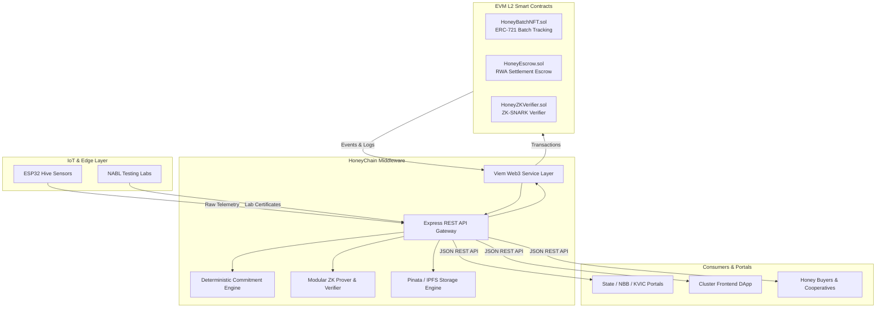

# HoneyChain Web3 Architecture & Implementation Specification

## 1. System Overview

HoneyChain is an open, modular Web3 middleware and data-integrity layer designed for rural beekeeping clusters. It connects off-chain IoT sensor hardware (ESP32), AI/ML anomaly detection, and NABL-accredited quality testing laboratories with on-chain Real-World Asset (RWA) batch tracking and trustless escrow settlement.

Existing government systems (such as KVIC, National Bee Board / Madhukranti, and State Honey Missions) can integrate seamlessly through standard REST APIs without running blockchain nodes or managing private keys.



---

## 2. Core Design Principles

1. **Off-Chain Telemetry, On-Chain Integrity**: High-frequency raw sensor streams are kept off-chain in IoT backends to avoid massive gas overhead. Only cryptographic commitments and milestone states are anchored on-chain.
2. **Honest Modular Zero-Knowledge**: Off-chain ZK provers prove telemetry compliance against strict hive health and honey quality bounds ($30^\circ\text{C}-38^\circ\text{C}$ temperature, $45\%-75\%$ humidity) and prove consistency with the data commitment without exposing private sensor histories.
3. **Deterministic Canonicalization**: Telemetry is normalized using fixed-precision integer scaling and sorted JSON keys prior to hashing with Keccak-256.
4. **Decentralized Storage via IPFS**: Rich metadata schemas and NABL laboratory reports are pinned to IPFS, storing content identifiers (CIDs) on-chain.
5. **Idempotent Middleware**: API endpoints automatically handle retry traffic from rural networks, returning existing token records instead of re-minting duplicate batches.

---

## 3. Smart Contract Specifications

### 3.1 `HoneyBatchNFT.sol`
- **Standard**: ERC-721 + OpenZeppelin `AccessControl`.
- **Roles**:
  - `DEFAULT_ADMIN_ROLE`: Contract administration.
  - `VERIFIER_ROLE`: Minting and authorized state transitions.
  - `BATCH_MINTER_ROLE`: Cluster-level harvesting agents.
  - `LAB_ROLE`: NABL accredited quality certification agencies.
- **State Machine**:
  $$\text{RAW\_HARVEST (0)} \longrightarrow \text{LAB\_VERIFIED (1)} \longrightarrow \text{PACKAGED\_RETAIL (2)}$$
  Strict transition validation prevents invalid jumps or backward state changes.
- **Unique Batch ID Protection**: `batchIdToTokenId` prevents duplicate on-chain mints for the same logical harvest batch.
- **Events**:
  - `event BatchMinted(uint256 indexed tokenId, string batchId)`
  - `event BatchStateChanged(uint256 indexed tokenId, BatchState newState)`
  - `event BatchVerified(uint256 indexed tokenId, bytes32 indexed dataCommitment, address indexed verifier)`

### 3.2 `HoneyEscrow.sol`
- **Purpose**: Conditional trade settlement between honey buyers/cooperatives and beekeepers.
- **States**: `CREATED (0)`, `FUNDED (1)`, `RELEASED (2)`, `REFUNDED (3)`, `DISPUTED (4)`.
- **Key Features**:
  - Direct or delayed funding in native ETH.
  - Immediate release upon quality verification by buyer, arbiter, or authorized escrow agent.
  - Timed refund protection: Buyers can reclaim funds after `releaseTimeout` if unfulfilled; arbiters can refund at any time.
  - ReentrancyGuard protection against re-entrancy exploits.

### 3.3 `HoneyZKVerifier.sol` & `IZKVerifier.sol`
- **Purpose**: Honest modular ZK-SNARK verifier interface and contract.
- **Public Signals Layout**:
  - `[0]`: `dataCommitment` (uint256 representation)
  - `[1]`: `minTemperature` (scaled $\times 100$)
  - `[2]`: `maxTemperature` (scaled $\times 100$)
  - `[3]`: `minHumidity` (scaled $\times 100$)
  - `[4]`: `maxHumidity` (scaled $\times 100$)
  - `[5]`: `harvestWindowStart` (Unix timestamp)
  - `[6]`: `harvestWindowEnd` (Unix timestamp)
  - `[7]`: `batchIdHash` (Keccak-256 hash as uint256)
- **Security**: Validates proof envelope, enforces signal boundary conditions, and provides hot-swappable circuit verification keys.

---

## 4. Middleware & Off-Chain Service Layer

### 4.1 Commitment Engine (`onchain/utils/commitment.ts`)
Produces deterministic 32-byte Keccak-256 digests:
```typescript
import { generateTelemetryCommitment } from "./onchain/utils/commitment.js";

const { commitment, canonicalString } = generateTelemetryCommitment({
  deviceId: "ESP32-HIVE-001",
  hiveId: "HIVE-101",
  batchId: "HONEY-2026-001",
  timestamp: 1756620000,
  temperature: 34.2,
  humidity: 61.4,
  weight: 22.7,
});
```

### 4.2 Modular ZK Service (`onchain/services/zkService.ts`)
Generates and verifies Groth16-compatible SNARK proof payloads with boundary witness checks and formatted calldata for EVM verifiers.

### 4.3 IPFS / Pinata Service (`onchain/services/ipfsService.ts`)
Uploads NABL PDF certificates and ERC-721 metadata schemas to IPFS via Pinata API, with automatic offline mock fallback for CI environments.

### 4.4 Web3 Viem Services (`onchain/services/`)
- `BatchService`: Batch minting, state transitions, idempotency checks, token queries.
- `EscrowService`: Escrow creation, funding, release, refund.
- `RoleService`: On-chain role queries, grants, and revocations.

---

## 5. Directory Structure
```
contracts/
  ├── HoneyBatchNFT.sol         # Core ERC-721 RWA Batch Token
  ├── HoneyEscrow.sol           # RWA Trade Settlement Escrow
  ├── HoneyZKVerifier.sol       # Modular ZK-SNARK Verifier
  └── interfaces/
      └── IZKVerifier.sol       # Standard ZK Verifier Interface
onchain/
  ├── abi/                      # Typed ABIs for Viem
  ├── addresses/                # Dynamic contract address manager
  ├── clients/                  # Viem client factory
  ├── services/                 # Batch, Escrow, ZK, IPFS, Role services
  ├── types/                    # TypeScript interfaces and enums
  └── utils/                    # Deterministic commitment engine
server/
  ├── app.ts                    # Express application configuration
  ├── index.ts                  # Server entrypoint
  └── routes/                   # REST API routes (devices, telemetry, ZK, batches, IPFS, escrow)
scripts/
  ├── deploy.ts                 # Full system deployment script
  └── seedDemo.ts               # Scenario demo seeder
test/
  ├── HoneyBatchNFT.test.ts     # Batch NFT unit & lifecycle tests
  ├── HoneyEscrow.test.ts       # Escrow unit & settlement tests
  ├── HoneyZKVerifier.test.ts   # ZK Verifier unit & constraint tests
  ├── commitment.test.ts        # Canonicalization unit tests
  ├── ipfsService.test.ts       # IPFS & metadata tests
  └── api.test.ts               # End-to-end REST API integration tests
docs/
  ├── WEB3_IMPLEMENTATION.md    # Architecture & implementation specs
  ├── API_INTEGRATION.md        # API integration guide for IoT/Portals/Frontend
  ├── ZK_ARCHITECTURE.md        # Detailed ZK-SNARK technical design
  └── DEPLOYMENT.md             # Setup, deployment, and testing guide
```
