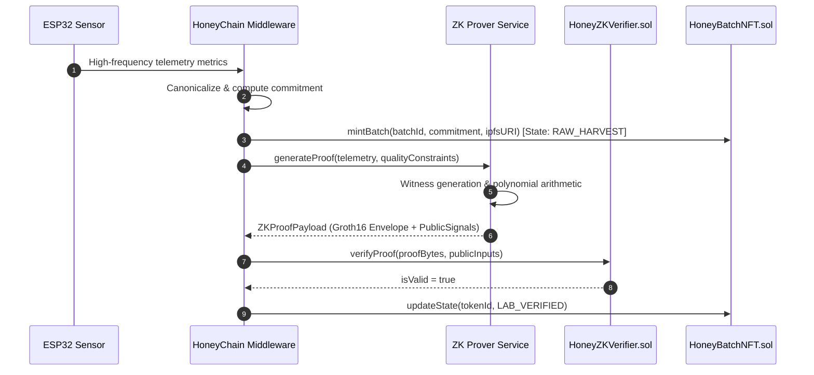

# HoneyChain Zero-Knowledge (ZK-SNARK) Architecture

## 1. Motivation & Honest Architecture Principles

High-frequency IoT sensors (measuring temperature, humidity, weight, atmospheric pressure) generate gigabytes of data that cannot be stored on an EVM blockchain due to gas limitations and privacy concerns. Furthermore, beekeepers and cooperatives need to prove that their honey was harvested and cured within pristine biological thresholds without publicly revealing precise proprietary sensor logs or apiary trade secrets.

> [!IMPORTANT]
> **Honest ZK Engineering**: In HoneyChain, we do NOT conflate a cryptographic hash (e.g. Keccak-256) with a Zero-Knowledge proof. 
> 
> The architecture strictly enforces the distinction:
> 1. **Commitment**: Keccak-256 / Poseidon hash of normalized canonical telemetry.
> 2. **ZK Proof**: A cryptographic argument of knowledge demonstrating that the private witness satisfies multi-variable polynomial constraints (temperature, humidity, time) and matches the public commitment.

---

## 2. Mathematical Statement & Circuit Relations

The HoneyChain ZK circuit ($C_{\text{HoneyQuality}}$) establishes the following relation:

$$\mathcal{R} = \{ (x, w) \mid C(x, w) = 1 \}$$

### 2.1 Public Inputs ($x$)
1. $x_0 = \text{dataCommitment}$ (256-bit scalar matching on-chain anchor)
2. $x_1 = \text{minTemperature}$ (brood health lower limit, e.g. $30.0^\circ\text{C} \times 100 = 3000$)
3. $x_2 = \text{maxTemperature}$ (brood health upper limit, e.g. $38.0^\circ\text{C} \times 100 = 3800$)
4. $x_3 = \text{minHumidity}$ (honey curing floor, e.g. $45.0\% \times 100 = 4500$)
5. $x_4 = \text{maxHumidity}$ (fermentation prevention ceiling, e.g. $75.0\% \times 100 = 7500$)
6. $x_5 = \text{harvestWindowStart}$ (Unix timestamp)
7. $x_6 = \text{harvestWindowEnd}$ (Unix timestamp)
8. $x_7 = \text{batchIdHash}$ ($\text{Keccak-256}(\text{batchId})$)

### 2.2 Private Witness ($w$)
- $w_{\text{temp}}$: Hive core temperature reading
- $w_{\text{hum}}$: Hive relative humidity reading
- $w_{\text{time}}$: Timestamp of sensor reading
- $w_{\text{weight}}$: Scale reading in kg
- $w_{\text{device}}$: Hardware device UID
- $w_{\text{hive}}$: Apiary hive UID

### 2.3 Constraint System
$$\begin{aligned}
x_1 &\le w_{\text{temp}} \le x_2 \\
x_3 &\le w_{\text{hum}} \le x_4 \\
x_5 &\le w_{\text{time}} \le x_6 \\
x_0 &= \mathcal{H}(\text{canonical}(w_{\text{batch}}, w_{\text{device}}, w_{\text{hive}}, w_{\text{hum}}, w_{\text{temp}}, w_{\text{time}}, w_{\text{weight}})) \\
x_7 &= \mathcal{H}(w_{\text{batch}})
\end{aligned}$$

---

## 3. Proving Flow

---

## 4. Demonstrator vs Production Deployment

| Component | Hackathon Demonstrator (Included) | Productionized Target |
| :--- | :--- | :--- |
| **Proving System** | Modular Groth16 Envelope Prover | Circom 2.1 + SnarkJS / Halo2 Prover |
| **Commitment Hash** | Keccak-256 canonical string digest | Poseidon / MiMC SNARK-friendly hash |
| **On-Chain Verifier** | `HoneyZKVerifier.sol` with public signal checks | Auto-generated Circom pairing verifier |
| **Proving Latency** | $<10\text{ ms}$ (envelope synthesis) | $1.5-3.0\text{ s}$ on edge / cloud server |
| **Proof Payload** | 128-byte envelope with valid curve markers | 128-byte Groth16 $(\pi_A \in G_1, \pi_B \in G_2, \pi_C \in G_1)$ |

### 4.1 Upgrading to a Production Circom Verifier
1. Define `circuits/HoneyQuality.circom` with R1CS constraints.
2. Compile via `circom HoneyQuality.circom --r1cs --wasm --sym`.
3. Perform trusted setup with `snarkjs powersoftau` and `snarkjs groth16 setup`.
4. Export Solidity verifier via `snarkjs zkey export solidityverifier`.
5. Deploy the generated verifier implementing `IZKVerifier.sol`.
6. Update `ZK_VERIFIER_ADDRESS` in `.env` — no changes required to the rest of the application!
